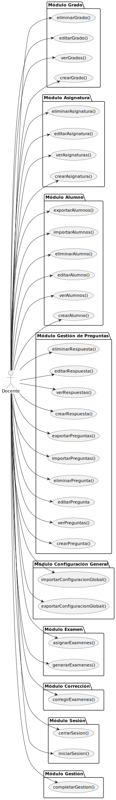

         

---

## Actores

### Docente: 

Es el actor que más interactúa con el sistema.

El docente tiene la capacidad de generar evaluaciones personalizadas y asignarlas a cada estudiante mediante una clave de identificación única.

La personalización de estos exámenes incluye la definición de:

- Cantidad de preguntas.

- Número de variantes del examen.

- Selección específica de tema o temas.

- Proporción de dificultad.

Para la generación, el sistema utiliza una batería de preguntas previamente cargada por el profesor. Adicionalmente, este sistema está equipado para corregir los exámenes realizados por los alumnos. Emplea Inteligencia Artificial basada en detección de imágenes para leer la clave, lo que permite recuperar el modelo de corrección asociado, y proceder a validar las respuestas del estudiante.

Estos son sus casos de uso:

|  |
| :--- |
| [Código UML](actoresYCasosDeUso-docente.puml) |

---

### Administrador institucional:

Es el "representante" de la universidad, su función es gestionar las cuentas para los **Docentes**. Son esas las cuentas que usarán los **Docentes** para `iniciarSesion()` y acceder al sistema.

Estos son sus casos de uso:

|  |
| :--- |
| [Código UML](actoresYCasosDeUso-administradorInstitucional.puml) |

---

### Tiempo:

Se encarga únicamente de cerrar sesión cuando hay un tiempo de inactividad determinado.

|  |
| :--- |
| [Código UML](actoresYCasosDeUso-tiempo.puml) |

