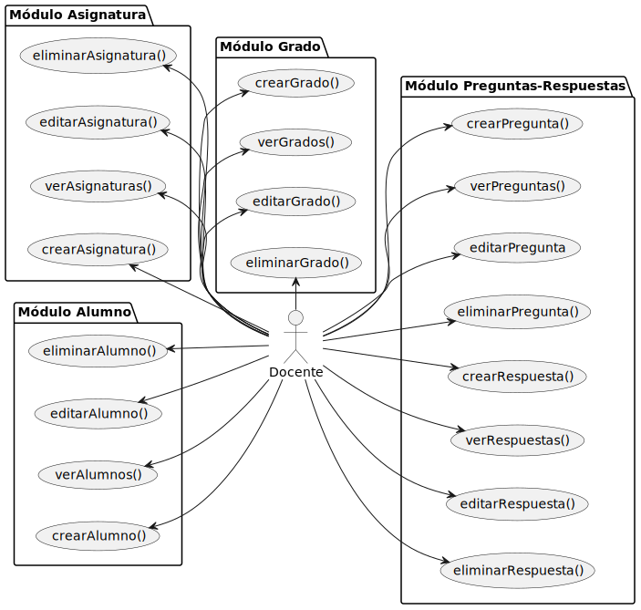
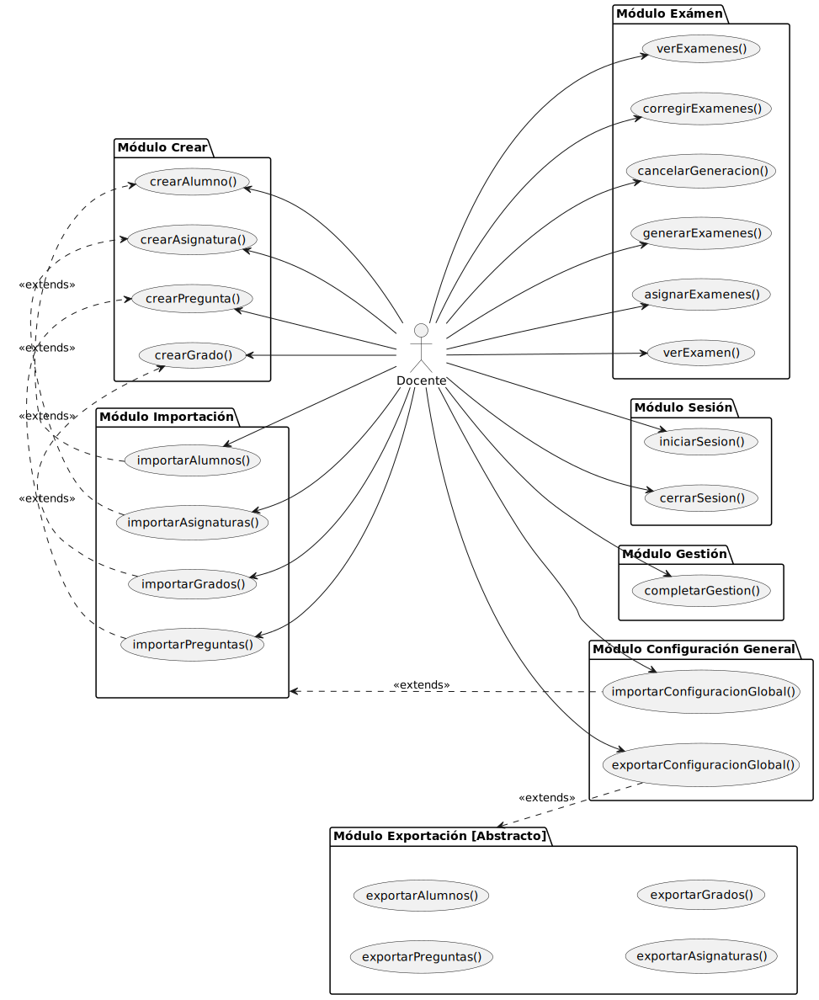
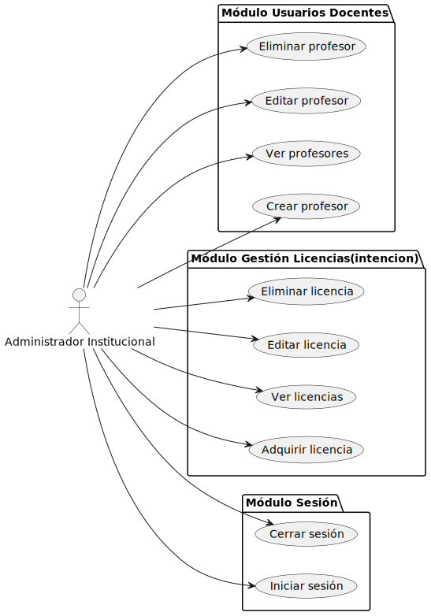
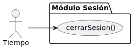

                

---

## Actores

### Docente: 

Es el actor que más interactúa con el sistema.

El docente tiene la capacidad de generar exámenes personalizados y asignarlos a cada alumno mediante una clave de identificación única.

Para la generación, el sistema utiliza una batería de preguntas de la asigantura seleccionada previamente poblada por el profesor. Además, este sistema corrige los exámenes realizados por los alumnos mediante inteligencia artificial basada en detección de imágenes para leer la clave, lo que permite recuperar el modelo de corrección asociado, y proceder a corregir las respuestas del alumno.

Estos son sus casos de uso:

|  |
| :--- |
| [Código UML](actoresYCasosDeUso-docente-maestro.puml) |

|  |
| :--- |
| [Código UML](actoresYCasosDeUso-docente-extra.puml) |

---

### Administrador institucional:

Es el encargado de la universidad de gestionar las cuentas para los Docentes. Son estas las cuentas que usarán los **Docentes** para `iniciarSesion()` y acceder al sistema.

Estos son sus casos de uso:

|  |
| :--- |
| [Código UML](actoresYCasosDeUso-administradorInstitucional.puml) |

---

### Tiempo:

Se encarga únicamente de cerrar sesión cuando pasa un tiempo de inactividad concreto.

|  |
| :--- |
| [Código UML](actoresYCasosDeUso-tiempo.puml) |

