                

## Prototipado de casos de uso

### Corregir Examenes [Docente]

| 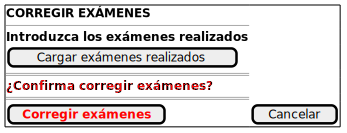 |
| :--- |
| [Código UML](corregirExamenes/corregirExamenesConfirmacion.puml) |

| 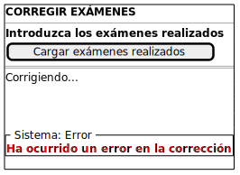 |
| :--- |
| [Código UML](corregirExamenes/corregirExamenesError.puml) |

### Generar Examenes [Docente]

| 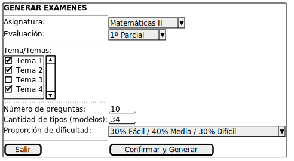 |
| :--- |
| [Código UML](generarExamenes/generarExamenesConfirmacion.puml) |

| 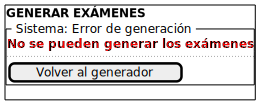 |
| :--- |
| [Código UML](generarExamenes/generarExamenesConfirmacionError.puml) |

### Importar Configuración Global [Docente]

| 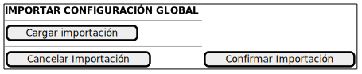 |
| :--- |
| [Código UML](importarConfiguracionGlobal/importarConfiguracionGlobalConfirmacion.puml) |

| 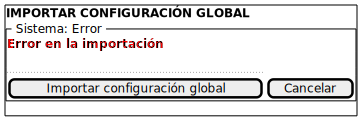 |
| :--- |
| [Código UML](importarConfiguracionGlobal/importarConfiguracionGlobalError.puml) |

### Exportar Configuración Global [Docente]

| 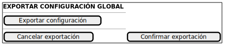 |
| :--- |
| [Código UML](exportarConfiguracionGlobal/exportarConfiguracionGlobalConfirmacion.puml) |

| 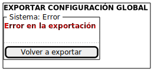 |
| :--- |
| [Código UML](exportarConfiguracionGlobal/exportarConfiguracionGlobalError.puml) |

### Importar Alumnos [Docente]

| 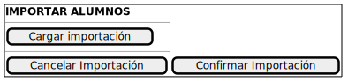 |
| :--- |
| [Código UML](importarAlumnos/importarAlumnosConfirmacion.puml) |

| 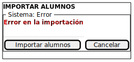 |
| :--- |
| [Código UML](importarAlumnos/importarAlumnosError.puml) |

### Importar Preguntas [Docente]

| 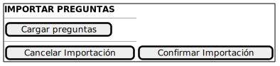 |
| :--- |
| [Código UML](importarPreguntas/importarPreguntasConfirmacion.puml) |

| 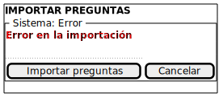 |
| :--- |
| [Código UML](importarPreguntas/importarPreguntasError.puml) |

### Exportar Alumnos [Docente]

| 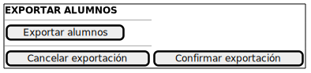 |
| :--- |
| [Código UML](exportarAlumnos/exportarAlumnosConfirmacion.puml) |

| 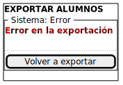 |
| :--- |
| [Código UML](exportarAlumnos/exportarAlumnosError.puml) |

### Exportar Preguntas [Docente]

| 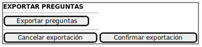 |
| :--- |
| [Código UML](exportarPreguntas/exportarPreguntasConfirmacion.puml) |

|  |
| :--- |
| [Código UML](exportarPreguntas/exportarPreguntasError.puml) |

### Asignar Exámenes [Docente]

| 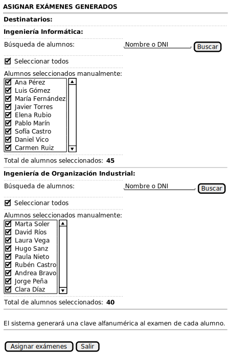 |
| :--- |
| [Código UML](asignarExamenes/asignarExamenes.puml) |

### Crear Pregunta [Docente]

| 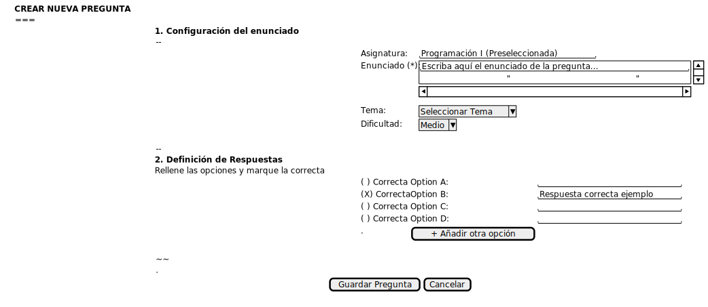 |
| :--- |
| [Código UML](crearPregunta/crearPregunta.puml) |

### Editar Pregunta [Docente]

| 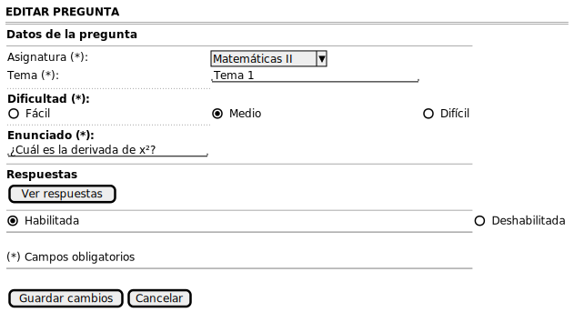 |
| :--- |
| [Código UML](editarPregunta/editarPregunta.puml) |

### Editar Asignatura [Docente]

| 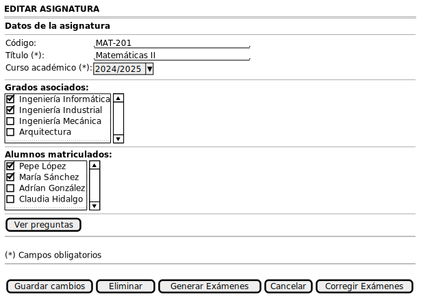 |
| :--- |
| [Código UML](editarAsignatura/editarAsignatura.puml) |

### Crear Docente [Aministrador Institucional]

| 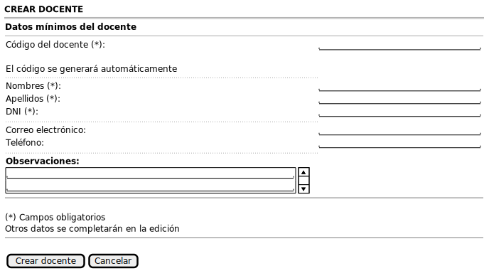 |
| :--- |
| [Código UML](crearDocente/crearDocente.puml) |

### Crear Alumno [Docente]

| 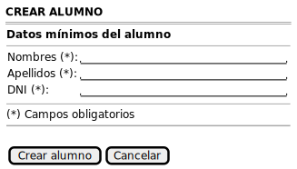 |
| :--- |
| [Código UML](crearAlumno/crearAlumno.puml) |

### Editar Docente [Aministrador Institucional]

| 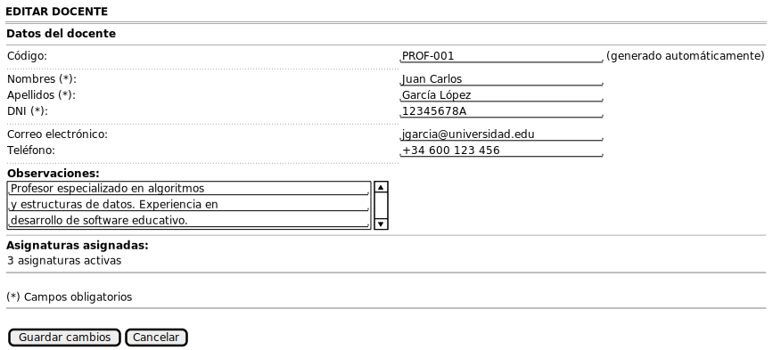 |
| :--- |
| [Código UML](editarDocente/editarDocente.puml) |

### Editar Alumno [Docente]

| 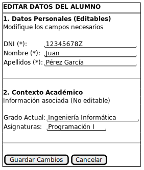 |
| :--- |
| [Código UML](editarAlumno/editarAlumno.puml) |

### Crear Grado [Docente]

| 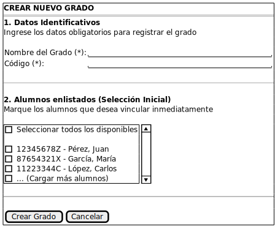 |
| :--- |
| [Código UML](crearGrado/crearGrado.puml) |

### Crear Asignatura [Docente]

| 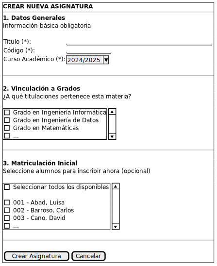 |
| :--- |
| [Código UML](crearAsignatura/crearAsignatura.puml) |

### Editar Grado [Docente]

|  |
| :--- |
| [Código UML](editarGrado/editarGrado.puml) |

### Ver Preguntas [Docente]

| 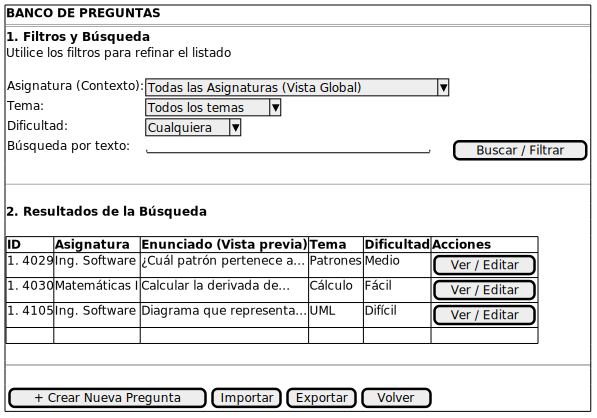 |
| :--- |
| [Código UML](verPreguntas/verPreguntas.puml) |

### Ver Asignaturas [Docente]

| 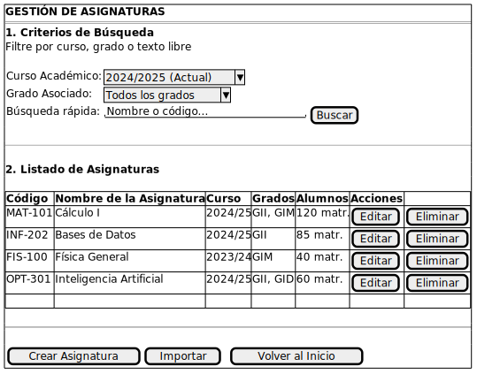 |
| :--- |
| [Código UML](verAsignaturas/verAsignaturas.puml) |

### Ver Grados [Docente]

| 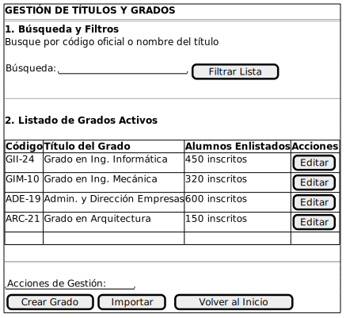 |
| :--- |
| [Código UML](verGrados/verGrados.puml) |

### Ver Alumnos [Docente]

|  |
| :--- |
| [Código UML](verAlumnos/verAlumnos.puml) |

### Ver Docentes [Aministrador Institucional]

| 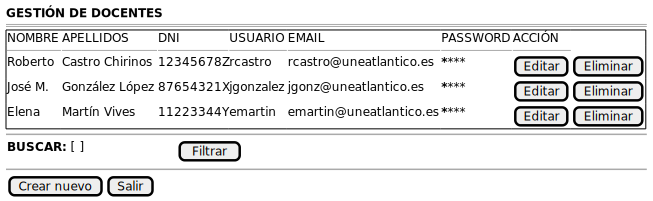 |
| :--- |
| [Código UML](verDocentes/verDocentes.puml) |

### Eliminar Pregunta [Docente]

|  |
| :--- |
| [Código UML](eliminarPregunta/eliminarPregunta.puml) |

### Eliminar Asignatura [Docente]

| 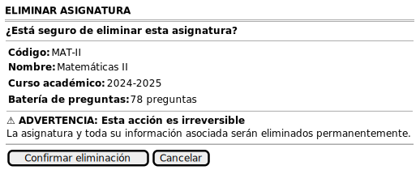 |
| :--- |
| [Código UML](eliminarAsignatura/eliminarAsignatura.puml) |

### Eliminar Grado [Docente]

| 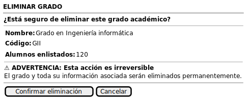 |
| :--- |
| [Código UML](eliminarGrado/eliminarGrado.puml) |

### Eliminar Alumno [Docente]

| 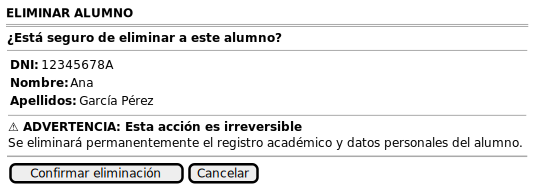 |
| :--- |
| [Código UML](eliminarAlumno/eliminarAlumno.puml) |

### Eliminar Docente [Aministrador Institucional]

| 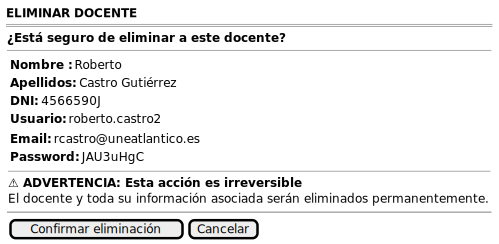 |
| :--- |
| [Código UML](eliminarDocente/eliminarDocente.puml) |

### Iniciar Sesión [Docente y Aministrador Institucional]

| 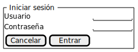 |
| :--- |
| [Código UML](iniciarSesion/iniciarSesion.puml) |

| 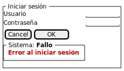 |
| :--- |
| [Código UML](iniciarSesion/iniciarSesionError.puml) |

### Cerrar Sesión [Docente y Aministrador Institucional]

| 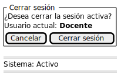 |
| :--- |
| [Código UML](cerrarSesion/cerrarSesionDocente.puml) |

| 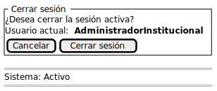 |
| :--- |
| [Código UML](cerrarSesion/cerrarSesionAdministracionInstitucional.puml) |

### Completar Gestión [Docente y Aministrador Institucional]

| 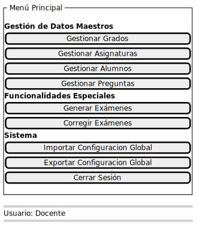 |
| :--- |
| [Código UML](completarGestion/completarGestionDocente.puml) |

| 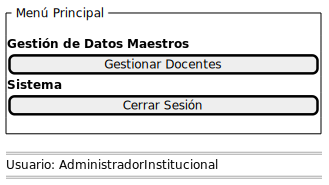 |
| :--- |
| [Código UML](completarGestion/completarGestionAdministradorInstitucional.puml) |

### Ver Respuestas [Docente]

| 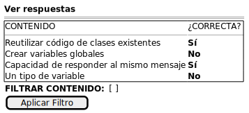 |
| :--- |
| [Código UML](verRespuestas/verRespuestas.puml) |

### Crear Respuesta [Docente]

| 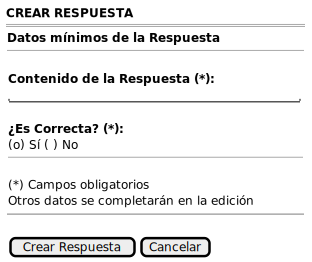 |
| :--- |
| [Código UML](crearRespuesta/crearRespuesta.puml) |

### Editar Respuesta [Docente]

| 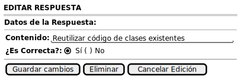 |
| :--- |
| [Código UML](editarRespuesta/editarRespuesta.puml) |

### Eliminar Respuesta [Docente]

| 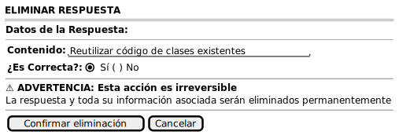 |
| :--- |
| [Código UML](eliminarRespuesta/eliminarRespuesta.puml) |